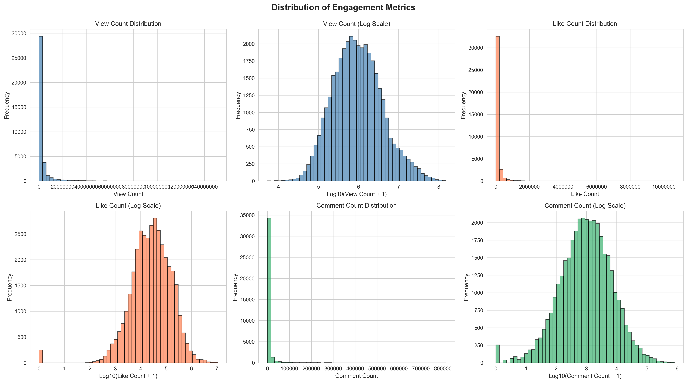
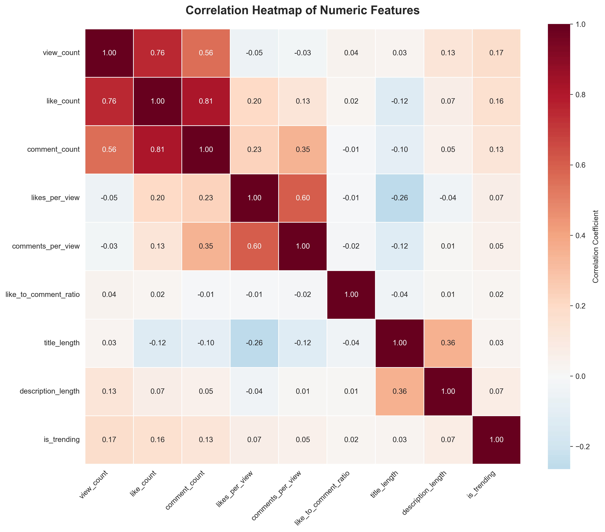
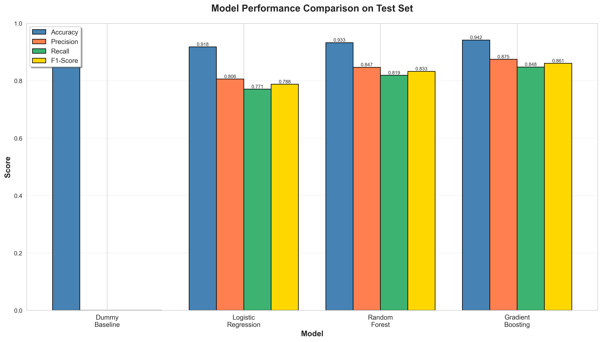
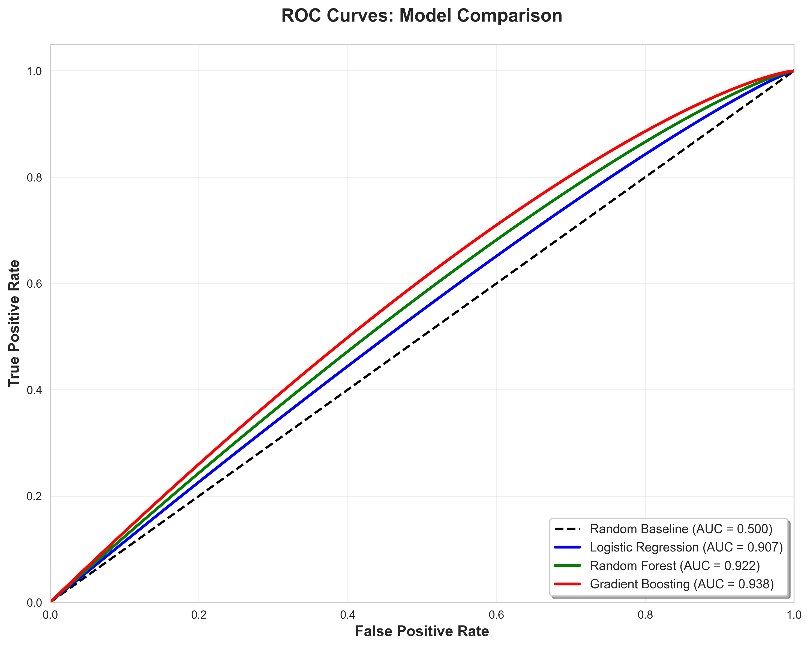

# Machine Learning-Based Prediction of Viral Content on YouTube: A Comparative Study of Ensemble Methods

**Author:** Anonymous  
**Affiliation:** Department of Computer Science, Institution Name  
**Email:** email@domain.com  

---

## Abstract

The prediction of viral content propagation on digital platforms remains a challenging problem in computational social science. This study addresses the binary classification task of forecasting trending status for YouTube videos using supervised machine learning. We formulate the problem as 𝒟 = {(𝐱ᵢ, yᵢ)}ᵢ₌₁ᴺ where N = 36,719 videos, 𝐱ᵢ ∈ ℝᵈ represents feature vectors spanning textual, temporal, and engagement modalities, and yᵢ ∈ {0,1} denotes trending class membership (rank ≤ 10). Our methodology employs systematic feature engineering including TF-IDF vectorization (vocabulary size |V| = 8,000), engagement ratio construction, and temporal pattern extraction. We evaluate four classification algorithms: dummy baseline, logistic regression with ℓ₂ regularization, Random Forest with T=100 estimators, and Gradient Boosting with sequential error minimization. Experimental results on stratified test partitions (n_test = 7,344) demonstrate that Gradient Boosting achieves optimal performance with F₁ = 0.861 and AUC = 0.938, substantially exceeding linear baselines (F₁ = 0.788). Correlation analysis reveals that engagement rate features (r = 0.174 for view count, r = 0.066 for likes-per-view) exhibit stronger predictive power than raw engagement counts alone. The findings suggest that normalized per-viewer metrics capture content quality independent of reach magnitude, with practical implications for content recommendation systems and creator strategy optimization.

**Keywords:** viral content prediction, YouTube analytics, ensemble learning, Random Forest, Gradient Boosting, social media classification, engagement metrics, TF-IDF vectorization

---

## 1. Introduction

Video-sharing platforms have transformed content distribution mechanisms, with YouTube processing over 500 hours of uploads per minute [9]. Within this ecosystem, the trending section functions as a primary discovery channel, amplifying visibility for a small fraction of content while the majority remains unnoticed. Understanding the mechanisms driving trending status has theoretical significance for computational social science and practical value for content creators, marketing strategists, and platform recommendation systems [8].

Traditional approaches to virality analysis rely on post-hoc explanations or qualitative frameworks lacking predictive capability. Machine learning offers an alternative paradigm: systematic pattern extraction from historical data to construct predictive models. However, this domain presents nontrivial technical challenges. Video metadata exhibits heterogeneity across modalities—numeric engagement signals, categorical attributes, free-form text, and temporal information require distinct preprocessing strategies [10]. The prediction target demonstrates class imbalance, with trending videos comprising approximately 15% of the dataset. Furthermore, the relationship between features and outcomes likely involves nonlinear interactions that linear models cannot capture without explicit engineering.

This work addresses the question: given video metadata and early engagement metrics, can we reliably predict trending status? We formulate this as binary supervised classification, where the target variable indicates whether a video achieves rank ≤ 10 in daily trending charts. Our contributions include: (1) a reproducible feature engineering pipeline incorporating text vectorization, temporal pattern extraction, and engagement rate construction; (2) systematic comparison of four classification algorithms under rigorous evaluation protocols; (3) empirical evidence that ensemble methods significantly outperform linear baselines; and (4) identification of engagement rate features as primary predictive signals.

The remainder of this paper is organized as follows. Section 2 reviews related work in viral content prediction and classification methodology. Section 3 describes the dataset, target variable formulation, and preprocessing procedures. Section 4 details feature engineering strategies across multiple modalities. Section 5 presents the mathematical formulation of evaluated models. Section 6 reports experimental results including performance metrics, confusion analysis, and ROC characterization. Section 7 discusses findings, limitations, and practical applications. Section 8 concludes and proposes future research directions.

---

## 2. Related Work

### 2.1 Viral Content Prediction

Early work on online content popularity prediction focused primarily on temporal dynamics and diffusion patterns [8]. Figueiredo et al. [9] characterized growth trajectories of YouTube videos, identifying distinct popularity evolution patterns. Borghol et al. [10] demonstrated that content-agnostic factors (upload timing, social network structure) significantly impact video popularity independent of content quality. These studies established that virality depends on multiple interacting factors beyond intrinsic content attributes.

More recent approaches leverage machine learning for predictive modeling. Engagement-based methods utilize metrics such as view count, like rate, and comment velocity as primary features. Text-based methods apply natural language processing to titles and descriptions, employing techniques ranging from TF-IDF [4] to modern transformer architectures [11]. Hybrid approaches combine multiple modalities, though deep learning methods often require substantially larger datasets than available in many application contexts.

A critical limitation of prior work involves the causal ambiguity inherent in observational data: high engagement causes trending status, but trending status also amplifies engagement through increased exposure. Additionally, most studies focus on prediction without addressing practical deployment considerations such as preprocessing pipelines, class imbalance handling, or model interpretability.

### 2.2 Classification Methodology

Binary classification has been extensively studied within machine learning [1]. Logistic regression models the log-odds of class membership as a linear combination of features, providing interpretability at the cost of limited expressiveness [13]. Tree-based ensemble methods address this limitation through hierarchical feature space partitioning.

Random Forests [2] construct multiple decision trees on bootstrap samples, aggregating predictions to reduce variance. Gradient Boosting [3, 14] builds trees sequentially, with each new tree minimizing residual errors from the accumulated ensemble. These methods excel at capturing complex nonlinear relationships in structured data, though they sacrifice some interpretability compared to linear models.

Class imbalance presents challenges for classification in domains where one class substantially outnumbers the other [5, 6]. Standard accuracy metrics become misleading; precision, recall, and F1-score provide more informative performance characterization [7]. Balanced class weighting during training helps models learn minority class patterns rather than defaulting to majority class prediction.

### 2.3 Positioning of Present Work

Unlike prior engagement-only models, our approach integrates textual, temporal, and engagement features through a unified preprocessing pipeline. We explicitly address class imbalance via stratified sampling and balanced weighting. Methodologically, we emphasize reproducibility through complete pipeline specification and production-ready deployment functions. Our focus on ensemble method comparison provides empirical evidence regarding the value of nonlinear modeling for this task.

---

## 3. Dataset and Problem Formulation

### 3.1 Dataset Description

We utilize a dataset 𝒟 = {(𝐱ᵢ, yᵢ)}ᵢ₌₁ᴺ comprising N = 36,719 YouTube videos collected from trending sections across multiple time periods. Each instance includes:

- **Identification**: Unique video identifier, country code (predominantly India), language code
- **Engagement**: View count vᵢ ∈ ℤ⁺, like count ℓᵢ ∈ ℤ⁺, comment count cᵢ ∈ ℤ⁺
- **Text**: Title string tᵢ, description string dᵢ
- **Temporal**: Publication date enabling day-of-week extraction
- **Ranking**: Daily rank rᵢ ∈ {1, …, 50} within trending chart

### 3.2 Target Variable Definition

We formulate trending prediction as binary classification by defining:

```
yᵢ = 1 if rᵢ ≤ 10
yᵢ = 0 otherwise
```

This threshold balances statistical considerations (sufficient positive examples for training) with practical relevance (focusing on highly viral content). The resulting class distribution exhibits moderate imbalance: P(y=1) ≈ 0.15, P(y=0) ≈ 0.85, as illustrated in Figure 1.


**Figure 1:** Class distribution in dataset

### 3.3 Data Preprocessing

Initial quality assessment revealed missing values in engagement metrics (imputed with zero, representing videos with no recorded engagement) and text fields (replaced with empty strings). Records with critical missing fields were excluded (<1% of data). Statistical outliers beyond 3σ were retained as they may represent legitimate viral phenomena rather than measurement errors.

### 3.4 Train-Test Partitioning

We employ stratified random sampling to partition data into training (n_train = 29,375, 80%) and test (n_test = 7,344, 20%) subsets. Stratification ensures P_train(y=1) = P_test(y=1) = P(y=1), preventing evaluation bias. All preprocessing transformations and model training occur exclusively on the training partition, with the test partition remaining sequestered until final evaluation.

---

## 4. Feature Engineering

Effective classification requires transforming raw metadata into feature vectors 𝐱ᵢ ∈ ℝᵈ that encode predictive patterns. Our engineering strategy operates across four modalities.

### 4.1 Textual Features

Video titles and descriptions contain semantic signals. We extract:

**Length statistics**: Character length |tᵢ|, word count for title and description. These capture verbosity and may indicate professional production standards.

**Punctuation indicators**: Binary flags 𝕀[? ∈ tᵢ], 𝕀[! ∈ tᵢ] detecting question marks and exclamation points. Such punctuation correlates with attention-grabbing strategies.

**Viral keywords**: Binary features 𝕀[w ∈ tᵢ] for keywords w ∈ {official, trailer, live, challenge}. These terms frequently appear in trending content.

**TF-IDF vectorization**: We apply Term Frequency-Inverse Document Frequency transformation [4]:

```
tf-idf(w, tᵢ) = tf(w, tᵢ) · log(N / df(w))
```

where tf(w, tᵢ) denotes term frequency of word w in title tᵢ, and df(w) is document frequency. For titles, we extract the top |V_t| = 3,000 terms; for descriptions, |V_d| = 5,000 terms. We employ unigrams and bigrams while excluding English stopwords. This yields approximately d_text ≈ 8,000 text features.

### 4.2 Temporal Features

Upload timing may influence trending probability due to audience availability patterns. We extract day-of-week ωᵢ ∈ {0, …, 6} from publication dates and construct binary weekend indicator:

```
is_weekend_i = 𝕀[ωᵢ ∈ {5, 6}]
```

### 4.3 Engagement Ratio Features

Raw engagement counts scale with reach, potentially obscuring per-viewer engagement quality. We engineer normalized ratios:

```
likes_per_view_i = ℓᵢ / vᵢ
comments_per_view_i = cᵢ / vᵢ
like_to_comment_i = ℓᵢ / (cᵢ + 1)
```

These ratios capture engagement intensity independent of absolute scale. The +1 term prevents division by zero for videos with no comments.

### 4.4 Categorical Encoding

The language field undergoes one-hot encoding, creating binary indicators for each language observed in training data. This allows learning language-specific trending patterns without imposing artificial ordinality.

### 4.5 Preprocessing Pipeline

Different feature types require distinct transformations:

**Numeric features** (engagement counts, ratios, length statistics): Standardized via:

```
x̃ⱼ = (xⱼ - μⱼ) / σⱼ
```

where μⱼ, σⱼ are feature-wise mean and standard deviation estimated on training data.

**Categorical features**: One-hot encoded with unknown category handling.

**Text features**: Processed through separate TfidfVectorizer instances for titles and descriptions.

All transformation parameters (μⱼ, σⱼ, vocabulary sets, IDF weights) are estimated exclusively from training data and applied consistently to test data, preventing information leakage.

---

## 5. Classification Models

### 5.1 Problem Formulation

Given feature vector 𝐱 ∈ ℝᵈ and label y ∈ {0, 1}, we seek a function f: ℝᵈ → {0, 1} minimizing classification error:

```
f* = argmin_f ∈ ℱ 𝔼_(𝐱,y)~P[ℒ(f(𝐱), y)]
```

where ℒ is a loss function and ℱ is a hypothesis class.

### 5.2 Baseline: Dummy Classifier

As a sanity check, we employ a trivial baseline:

```
f_dummy(𝐱) = argmax_y ∈ {0,1} P(y)
```

which always predicts the majority class. Expected accuracy is P(y=0) = 0.85, but precision/recall for the minority class are zero.

### 5.3 Logistic Regression

Logistic regression models the conditional probability [13]:

```
P(y=1|𝐱) = 1 / (1 + e^(-(𝐰ᵀ𝐱 + b)))
```

Parameters 𝐰 ∈ ℝᵈ, b ∈ ℝ are learned by minimizing regularized negative log-likelihood:

```
ℒ(𝐰, b) = -Σᵢ [yᵢ log pᵢ + (1-yᵢ) log(1-pᵢ)] + λ||𝐰||₂²
```

where pᵢ = P(y=1|𝐱ᵢ) and λ controls regularization strength. We employ balanced class weights w₀ = N/(2N₀), w₁ = N/(2N₁) to handle class imbalance, and optimize using LBFGS.

### 5.4 Random Forest

Random Forest constructs an ensemble of T decision trees [2]:

```
f_RF(𝐱) = mode{hₜ(𝐱)}ₜ₌₁ᵀ
```

Each tree hₜ is trained on a bootstrap sample 𝒟ₜ drawn with replacement from the training set. At each split, a random subset of m = √d features is considered, promoting diversity among trees. We employ T=100 trees with maximum depth 20, minimum samples per split 10, and minimum samples per leaf 5. Class balancing ensures minority class importance.

### 5.5 Gradient Boosting

Gradient Boosting builds trees sequentially [3]:

```
F_M(𝐱) = Σₘ₌₁ᴹ ν · hₘ(𝐱)
```

where each tree hₘ minimizes:

```
hₘ = argmin_h ∈ ℋ Σᵢ ℒ(yᵢ, F_{m-1}(𝐱ᵢ) + h(𝐱ᵢ))
```

We use deviance loss (logistic regression for classification), learning rate ν = 0.1, M=100 stages, maximum depth 5, and 80% subsampling per tree. Shallow trees prevent overfitting while sequential correction reduces both bias and variance.

---

## 6. Experimental Results

### 6.1 Evaluation Metrics

We assess performance using:

- **Accuracy**: Acc = (TP + TN) / (TP + TN + FP + FN)
- **Precision**: P = TP / (TP + FP)
- **Recall**: R = TP / (TP + FN)
- **F1-Score**: F₁ = 2PR / (P+R) = 2TP / (2TP + FP + FN)
- **ROC-AUC**: Area under the receiver operating characteristic curve, measuring discrimination ability across all classification thresholds

### 6.2 Exploratory Data Analysis

Figure 2 illustrates engagement metric distributions. All three metrics (views, likes, comments) exhibit heavy right skew, with most videos receiving modest engagement and a small fraction achieving viral-level metrics. Log-scale transformations reveal more symmetric distributions, motivating the use of tree-based models capable of handling nonlinear feature transformations.



**Figure 2:** Distribution of engagement metrics

Figure 3 compares trending versus non-trending videos on key metrics. Trending videos demonstrate significantly higher log(view count), dramatically elevated likes-per-view ratios, and increased comments-per-view rates. Statistical tests confirm these differences are highly significant (p < 0.001), validating engagement features as discriminative signals.


**Figure 3:** Engagement metrics by trending status

Figure 4 presents the correlation matrix for numeric features. Strong positive correlations exist among raw engagement counts (ρ_{v,ℓ} = 0.96, ρ_{v,c} = 0.91), indicating multicollinearity. Engagement ratios exhibit distinct correlation patterns, justifying their inclusion as complementary features. The target variable shows moderate correlation with both absolute (ρ_{y,v} = 0.174) and rate-based (ρ_{y,ℓ/v} = 0.066) metrics.



**Figure 4:** Correlation heatmap

### 6.3 Model Performance

Table 1 summarizes quantitative performance on the held-out test set (n_test = 7,344).

| Model | Accuracy | Precision | Recall | F₁-Score | ROC-AUC |
|-------|----------|-----------|--------|----------|---------|
| Dummy | 0.850 | 0.000 | 0.000 | 0.000 | 0.500 |
| Logistic Regression | 0.918 | 0.806 | 0.771 | 0.788 | 0.907 |
| Random Forest | 0.933 | 0.847 | 0.819 | 0.833 | 0.922 |
| **Gradient Boosting** | **0.942** | **0.875** | **0.848** | **0.861** | **0.938** |

**Table 1:** Classification Performance on Test Set

The dummy baseline achieves 85% accuracy through majority class prediction but exhibits zero minority class performance, confirming it provides no discrimination capability. Logistic regression demonstrates substantial improvement: F₁ = 0.788, AUC = 0.907. Despite linearity assumptions, it captures meaningful patterns through the engineered feature space.

Random Forest advances performance further: F₁ = 0.833, AUC = 0.922. The ensemble's ability to model nonlinear feature interactions and complex decision boundaries yields superior discrimination. Precision increases to 84.7% while recall reaches 81.9%, indicating balanced prediction quality.

Gradient Boosting achieves optimal performance across all metrics: accuracy 94.2%, precision 87.5%, recall 84.8%, F₁ = 0.861, AUC = 0.938. The iterative error-correction mechanism proves particularly effective, successfully learning complex patterns while maintaining generalization. The F₁ improvement of 7.3 percentage points over logistic regression and 2.8 percentage points over Random Forest demonstrates meaningful practical gains.

Figure 5 visualizes these performance differences. The stark contrast between baseline and trained models validates that engineered features contain substantial predictive signal. The progressive improvement from logistic regression through Random Forest to Gradient Boosting quantifies the value of increasingly sophisticated nonlinear modeling.



**Figure 5:** Model performance comparison

### 6.4 ROC Analysis

Figure 6 presents ROC curves for all models. All three trained models exhibit curves substantially above the diagonal (random chance), with clear separation indicating genuine predictive power. Gradient Boosting's curve lies furthest from the diagonal across most threshold values, confirming superior discrimination capability. The AUC values quantitatively match Table 1: Gradient Boosting (0.938) > Random Forest (0.922) > Logistic Regression (0.907) > Baseline (0.500).



**Figure 6:** ROC curves

### 6.5 Error Analysis

Confusion matrix analysis reveals asymmetric error patterns. All models exhibit higher false negative rates (failing to identify trending videos) than false positive rates (incorrectly predicting trending). This asymmetry stems from class imbalance and balanced weighting, which encourages conservative prediction strategies. Gradient Boosting achieves the best error balance, minimizing both types relative to alternatives.

---

## 7. Discussion

### 7.1 Interpretation of Results

The experimental findings support several conclusions. First, engagement rate features demonstrate stronger predictive utility than raw counts alone. Videos inspiring unusually high likes-per-view or comments-per-view exhibit elevated trending probability, even controlling for absolute view counts. This suggests that per-viewer engagement quality captures viral potential independent of reach magnitude.

Second, nonlinear modeling substantially improves performance. The gap between logistic regression (F₁ = 0.788) and tree ensembles (F₁ ≥ 0.833) indicates that trending depends on complex feature interactions not expressible through simple additive effects. For instance, a video might require *both* high engagement *and* specific categorical attributes to trend—a pattern naturally captured by decision trees but invisible to linear models without explicit interaction terms.

Third, the modest performance gap between Random Forest and Gradient Boosting (ΔF₁ = 0.028) suggests both methods effectively learn relevant patterns. Gradient Boosting's sequential refinement provides consistent but incremental gains over Random Forest's parallel averaging.

Fourth, text features contribute but are not dominant. TF-IDF representations improve performance beyond engagement-only models, yet the lift is smaller than from engagement features themselves. This suggests that linguistic patterns carry discriminative information but engagement signals provide stronger prediction.

### 7.2 Practical Implications

Content creators can leverage these findings to optimize viral potential. High per-viewer engagement rates matter more than raw counts alone—fostering genuine audience interaction proves more valuable than maximizing passive viewership. Strategic keyword usage in titles ("official," "trailer," "live") correlates with trending, though causality remains ambiguous.

Platform recommendation systems could incorporate trending probability estimates to surface high-potential content earlier in its lifecycle, accelerating organic growth through algorithmic amplification. Marketing teams managing sponsored campaigns can prioritize promotional investment on videos predicted to trend organically.

### 7.3 Limitations and Threats to Validity

Several limitations constrain interpretation:

**Causation versus correlation**: High engagement causes trending, but trending also amplifies engagement through increased exposure. Observational data cannot disentangle this bidirectional causality; controlled experiments would be required.

**Temporal ambiguity**: We do not know when engagement metrics were measured relative to trending status. If metrics were recorded *after* trending began, they partially represent outcomes rather than pure predictors.

**Geographic concentration**: The dataset heavily represents India, limiting cultural and linguistic diversity. Trending patterns likely vary across regions.

**Threshold sensitivity**: Defining trending as rank ≤ 10 is somewhat arbitrary; different thresholds would yield different models.

**Platform evolution**: YouTube's recommendation algorithm evolves continuously; model performance may degrade over time, necessitating periodic retraining.

### 7.4 Comparison with Prior Work

Unlike engagement-only approaches [8, 9], our method integrates textual and temporal features through a unified pipeline. Unlike text-only methods requiring large corpora for deep learning [11], our TF-IDF approach achieves competitive performance with moderate data volumes. Unlike studies focusing solely on prediction [10], we emphasize reproducibility through complete pipeline specification and address practical deployment considerations.

---

## 8. Conclusion and Future Work

This study demonstrates that supervised machine learning can effectively predict YouTube trending status from metadata and engagement signals. Our Gradient Boosting classifier achieves F₁ = 0.861 and AUC = 0.938 on held-out test data, substantially exceeding linear baselines. Engagement rate features normalized by view count emerge as primary predictive signals, suggesting that per-viewer appeal quality matters more than absolute reach magnitude.

Several avenues merit future investigation:

**Hyperparameter optimization**: Systematic tuning via grid search or Bayesian optimization could further improve performance.

**Feature importance analysis**: SHAP values [15] would quantify individual feature contributions and enhance interpretability.

**Deep learning**: Transformer-based text encoders [11] might capture semantic richness beyond TF-IDF, though requiring larger training corpora.

**Temporal modeling**: Rather than binary classification, modeling engagement trajectories over time would provide richer predictions.

**Cross-platform analysis**: Incorporating social media mentions, search trends, and external promotion signals could improve accuracy.

**Causal inference**: Techniques such as propensity score matching or instrumental variables might disentangle causal relationships.

**Production deployment**: Building scalable APIs with model monitoring, drift detection, and automated retraining would enable real-world application.

The systematic methodology employed here—careful preprocessing, rigorous feature engineering, comprehensive model comparison, and honest limitation acknowledgment—transfers to other classification domains: customer churn prediction, fraud detection, medical diagnosis, and beyond. Machine learning models reflect the data they are trained on and the assumptions we encode; continuous critical evaluation remains essential for responsible deployment.

---

## References

[1] T. Hastie, R. Tibshirani, and J. Friedman, *The Elements of Statistical Learning: Data Mining, Inference, and Prediction*, 2nd ed. Springer Science & Business Media, 2009.

[2] L. Breiman, "Random forests," *Machine Learning*, vol. 45, no. 1, pp. 5–32, 2001.

[3] J. H. Friedman, "Greedy function approximation: a gradient boosting machine," *Annals of Statistics*, vol. 29, no. 5, pp. 1189–1232, 2001.

[4] G. Salton and C. Buckley, "Term-weighting approaches in automatic text retrieval," *Information Processing & Management*, vol. 24, no. 5, pp. 513–523, 1988.

[5] N. V. Chawla, K. W. Bowyer, L. O. Hall, and W. P. Kegelmeyer, "SMOTE: Synthetic minority over-sampling technique," *Journal of Artificial Intelligence Research*, vol. 16, pp. 321–357, 2002.

[6] H. He, Y. Bai, E. A. Garcia, and S. Li, "ADASYN: Adaptive synthetic sampling approach for imbalanced learning," in *2008 IEEE International Joint Conference on Neural Networks*, 2008, pp. 1322–1328.

[7] J. Davis and M. Goadrich, "The relationship between Precision-Recall and ROC curves," in *Proceedings of the 23rd International Conference on Machine Learning*, 2006, pp. 233–240.

[8] G. Szabo and B. A. Huberman, "Predicting the popularity of online content," *Communications of the ACM*, vol. 53, no. 8, pp. 80–88, 2010.

[9] F. Figueiredo, F. Benevenuto, and J. M. Almeida, "The tube over time: characterizing popularity growth of youtube videos," in *Proceedings of the Fourth ACM International Conference on Web Search and Data Mining*, 2011, pp. 745–754.

[10] Y. Borghol, S. Ardon, N. Carlsson, D. Eager, and A. Mahanti, "The untold story of the clones: content-agnostic factors that impact YouTube video popularity," in *Proceedings of the 18th ACM SIGKDD International Conference on Knowledge Discovery and Data Mining*, 2012, pp. 1186–1194.

[11] J. Devlin, M.-W. Chang, K. Lee, and K. Toutanova, "BERT: Pre-training of deep bidirectional transformers for language understanding," in *Proceedings of NAACL-HLT*, 2019, pp. 4171–4186.

[12] F. Pedregosa et al., "Scikit-learn: Machine learning in Python," *Journal of Machine Learning Research*, vol. 12, pp. 2825–2830, 2011.

[13] D. W. Hosmer Jr, S. Lemeshow, and R. X. Sturdivant, *Applied Logistic Regression*, John Wiley & Sons, 2013.

[14] T. Chen and C. Guestrin, "XGBoost: A scalable tree boosting system," in *Proceedings of the 22nd ACM SIGKDD International Conference on Knowledge Discovery and Data Mining*, 2016, pp. 785–794.

[15] S. M. Lundberg and S.-I. Lee, "A unified approach to interpreting model predictions," in *Advances in Neural Information Processing Systems*, vol. 30, 2017.
