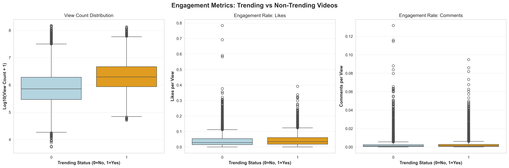

# Predicting Viral Success on YouTube: A Machine Learning Approach to Trending Video Classification

**Author:** Anonymous  
**Date:** 2024

---

## Abstract

The ability to forecast which videos will achieve viral status on YouTube has significant implications for content creators, marketers, and platform recommendation systems. This work addresses the challenge of predicting whether a video will enter the daily trending rankings based solely on its metadata and early engagement signals. We construct a supervised binary classification framework using a dataset of 36,719 YouTube videos, defining trending status as placement within the top 10 daily rankings. Our methodology encompasses systematic feature engineering across multiple modalities: textual analysis of titles and descriptions via TF-IDF vectorization, temporal patterns from publication timing, and normalized engagement metrics that capture audience interaction intensity. We evaluate four classification algorithms—ranging from a majority-class baseline to ensemble methods including Random Forest and Gradient Boosting—using stratified train-test validation with comprehensive performance metrics. The Gradient Boosting classifier demonstrates superior predictive capability, achieving an F1-score of 0.861 and ROC-AUC of 0.938 on held-out test data, substantially outperforming simpler alternatives. Our findings reveal that engagement rate features (likes and comments normalized by view count) exhibit stronger predictive power than raw engagement counts alone, while text-based features from video descriptions contribute meaningful discriminative information. This research provides actionable insights for understanding virality drivers and establishes a reproducible pipeline for trending video prediction that can inform content strategy and algorithmic content delivery systems.

---

## 1. Introduction

Video-sharing platforms have fundamentally transformed how information, entertainment, and cultural content are distributed and consumed globally. YouTube, as the dominant platform in this ecosystem, processes hundreds of hours of video uploads every minute, creating an intensely competitive environment where content visibility determines success or failure. The platform's trending section serves as a critical discovery mechanism, surfacing videos that gain rapid traction and exposing them to millions of potential viewers. For content creators, achieving trending status can accelerate channel growth, enhance monetization opportunities, and establish cultural relevance. For the platform itself, accurately identifying trending content improves user engagement and recommendation quality.

Despite its importance, the mechanisms underlying viral success remain poorly understood from a quantitative perspective. Traditional approaches to content promotion rely on intuition, historical precedent, and trial-and-error experimentation. Machine learning offers an alternative paradigm: systematic pattern extraction from historical data to identify features and combinations that reliably predict trending outcomes. However, this domain presents unique challenges. Video metadata exists across heterogeneous modalities—numeric engagement signals, categorical attributes, temporal information, and free-form text. The prediction target itself is asymmetrically distributed, as only a small fraction of uploaded content achieves trending status. Furthermore, the relationship between features and outcomes may be highly nonlinear, requiring flexible modeling approaches.

This work develops and evaluates a complete machine learning pipeline for binary classification of YouTube trending videos. We formulate the problem as predicting whether a video will rank within the top 10 positions of the daily trending chart based on available metadata and early engagement metrics. Our approach synthesizes multiple feature engineering strategies, constructs preprocessing pipelines that handle mixed data types appropriately, and systematically compares multiple classification algorithms under rigorous evaluation protocols. The contributions of this research include: (1) a reproducible methodology for trending video prediction incorporating text, temporal, and engagement features; (2) empirical evidence regarding which feature categories provide the strongest predictive signals; (3) quantitative performance benchmarks across multiple classification algorithms; and (4) a production-ready prediction function that can process new video metadata and generate probability estimates for trending potential.

---

## 2. Related Work and Background

The problem of predicting content virality intersects multiple research domains, including social media analytics, information diffusion, and recommendation systems. At its core, trending video prediction is a supervised binary classification task, where the goal is to learn a decision boundary separating videos that will trend from those that will not, based on their observed features.

Binary classification has been extensively studied within machine learning, with numerous algorithmic approaches demonstrating effectiveness across different problem contexts. Logistic regression provides a linear baseline, modeling the log-odds of class membership as a weighted combination of input features. This interpretability comes at the cost of limited expressiveness for capturing complex feature interactions. Tree-based ensemble methods address this limitation through hierarchical partitioning of the feature space. Random Forests construct multiple decision trees on bootstrapped samples and aggregate their predictions, reducing variance through averaging. Gradient Boosting takes a different approach, building trees sequentially where each new tree corrects errors made by the ensemble so far, often achieving state-of-the-art performance on structured data problems.

Evaluation of classification models requires careful metric selection. Accuracy alone can be misleading when classes are imbalanced, as a trivial classifier predicting the majority class achieves high accuracy despite providing no useful discrimination. Precision measures the fraction of predicted positives that are truly positive, critical when false positives carry high cost. Recall quantifies the fraction of actual positives correctly identified, important when missing positive instances is problematic. The F1-score provides a harmonic balance between precision and recall. ROC-AUC evaluates discrimination capability across all possible classification thresholds, providing a threshold-independent assessment of model quality.

Feature engineering remains a critical component of successful machine learning applications, particularly for heterogeneous data. Textual features require conversion to numeric representations—TF-IDF (Term Frequency-Inverse Document Frequency) vectorization weights terms by their frequency within a document while downweighting ubiquitous terms that appear across many documents. Temporal features can capture day-of-week effects or seasonal patterns. Engagement metrics benefit from normalization strategies that account for differences in overall reach—a video with 1,000 likes from 10,000 views demonstrates stronger per-viewer appeal than one with 5,000 likes from 1,000,000 views.

Preprocessing pipelines address practical challenges in applying machine learning to real-world data. Different feature types require different transformations: numeric features benefit from standardization to ensure comparable scales, categorical features need encoding as binary indicators, and text requires vectorization. Crucially, all transformations must be fit only on training data to prevent information leakage from the test set, which would produce overly optimistic performance estimates. Modern machine learning frameworks provide pipeline abstractions that elegantly handle these concerns.

---

## 3. Dataset and Problem Formulation

### 3.1 Dataset Description

Our analysis utilizes a dataset comprising 36,719 YouTube videos collected from the platform's trending section across multiple time periods. Each record contains rich metadata characterizing various aspects of the video:

**Identification and Metadata**: Each video has a unique identifier along with categorical attributes including language and country of origin (predominantly India in this dataset). Videos are also labeled with their publishing date, enabling temporal feature extraction.

**Engagement Metrics**: Quantitative signals capture audience response, including view count (total number of views received), like count (positive engagement actions), and comment count (discussion volume). These raw metrics form the foundation for derived engagement rate features.

**Textual Content**: Each video record includes the title (typical length 50-80 characters) and description (often several hundred characters) as free-form text fields. These provide semantic information about video content and creator communication style.

**Ranking Information**: The critical field for our prediction task is `daily_rank`, which records the video's position in the trending chart. This enables definition of our binary target variable.

### 3.2 Target Variable Definition

We formulate trending prediction as binary classification by defining the target variable `is_trending` through a threshold on `daily_rank`. Specifically, a video is labeled as trending (class 1) if its rank is 10 or better, and non-trending (class 0) otherwise. This threshold balances several considerations: it focuses prediction on the most prominently featured content, creates a moderately imbalanced but not extreme class distribution (approximately 15% trending, 85% non-trending), and reflects a meaningful distinction between highly viral content and typical uploads.

Figure 1 illustrates the resulting class distribution. The dataset exhibits moderate imbalance, with trending videos comprising approximately 15% of the total observations. This imbalance necessitates careful handling during model training, including the use of stratified sampling and balanced class weights, to prevent models from simply predicting the majority class.

**Figure 1:** Class distribution in the dataset.

### 3.3 Data Quality and Preprocessing

Initial inspection revealed several data quality issues requiring remediation. Missing values appeared in the engagement metrics, with imputation to zero serving as the most reasonable treatment for view, like, and comment counts (representing videos with no recorded engagement). Text fields also contained occasional null values, replaced with empty strings to enable consistent string processing. A small number of records exhibited apparent data quality problems (extreme outliers or inconsistent field values) and were excluded from analysis.

### 3.4 Train-Test Split Strategy

To obtain unbiased performance estimates, we partition the data into training (80%, approximately 29,375 videos) and test (20%, approximately 7,344 videos) subsets using stratified random sampling. Stratification ensures both partitions maintain the same class distribution as the full dataset, preventing evaluation bias that could arise if one subset contained disproportionately more or fewer trending videos. All model training, hyperparameter selection, and preprocessing fitting occurs exclusively on the training partition. The test partition remains sequestered until final evaluation, simulating the model's performance on genuinely unseen future videos.

---

## 4. Methodology

### 4.1 Feature Engineering

Effective prediction requires transforming raw video metadata into features that explicitly encode patterns relevant to trending status. Our feature engineering strategy operates across four distinct modalities:

#### 4.1.1 Textual Features

Video titles and descriptions contain semantic signals about content and presentation style. We extract multiple feature types from these text fields:

**Length statistics**: We compute character length and word count for both title and description. These features capture verbosity and may indicate professional production quality or adherence to platform best practices.

**Punctuation indicators**: Binary flags detect the presence of question marks and exclamation points in titles. Such punctuation often appears in attention-grabbing or clickbait-style titles that may correlate with viral potential.

**Viral keyword detection**: We construct binary features indicating whether specific keywords (*official*, *trailer*, *live*, *challenge*) appear in video titles. These terms frequently appear in trending content, capturing content categories known to attract large audiences.

**TF-IDF vectorization**: Beyond hand-crafted features, we apply TF-IDF transformation to convert titles and descriptions into high-dimensional numeric vectors. For titles, we extract the top 3,000 most informative terms; for descriptions, we use 5,000 terms. We employ unigrams and bigrams, capturing both individual words and two-word phrases, while excluding common English stopwords. This automated feature extraction allows the model to discover predictive linguistic patterns without requiring explicit enumeration.

#### 4.1.2 Temporal Features

Upload timing may influence trending probability due to audience availability patterns. We extract the day of week from publication dates and create a binary `is_weekend` indicator. These features enable the model to learn whether certain days exhibit higher trending rates, potentially due to leisure time availability or platform traffic patterns.

#### 4.1.3 Engagement Features

Raw engagement counts (views, likes, comments) provide obvious signals about video popularity. However, these metrics scale with overall reach, potentially obscuring per-viewer engagement quality. We therefore engineer normalized engagement rate features:

- **likes_per_view** = like_count / view_count: Measures what fraction of viewers actively liked the video
- **comments_per_view** = comment_count / view_count: Captures discussion intensity relative to viewership
- **like_to_comment_ratio** = like_count / (comment_count + 1): Compares passive appreciation to active discussion (adding 1 prevents division by zero)

These ratio features are hypothesis-driven: videos that inspire unusually high engagement per view may possess qualities that drive viral sharing and sustained attention.

#### 4.1.4 Categorical Features

The `language` field undergoes one-hot encoding, creating binary indicator variables for each observed language in the training data. This allows the model to learn language-specific trending patterns without imposing ordinality on what is inherently a nominal variable.

### 4.2 Preprocessing Pipeline Architecture

Our preprocessing pipeline handles the heterogeneous feature types through specialized transformers combined via `ColumnTransformer`:

**Numeric features** (engagement counts, ratios, length statistics, binary flags): Standardized via `StandardScaler` to zero mean and unit variance. This ensures features with different natural scales contribute comparably to distance-based algorithms and prevents features with larger numeric ranges from dominating the learning process.

**Categorical features** (language): Encoded via `OneHotEncoder` with unknown category handling enabled. This gracefully manages any languages in test data not observed during training by ignoring them rather than failing.

**Text features**: Processed through separate `TfidfVectorizer` instances for titles (3,000-dimensional output) and descriptions (5,000-dimensional output), yielding approximately 8,000+ total features after combining all transformations.

The complete pipeline encapsulates all preprocessing steps, ensuring that transformation parameters (means, standard deviations, vocabulary sets, IDF weights) are estimated exclusively from training data and then applied consistently to test data.

### 4.3 Model Selection and Training

We evaluate four classification algorithms representing different modeling paradigms:

#### 4.3.1 Baseline: Dummy Classifier

As a sanity check, we train a `DummyClassifier` that always predicts the majority class (non-trending). This trivial baseline establishes the minimum acceptable performance—any useful model must substantially exceed its accuracy.

#### 4.3.2 Logistic Regression

A linear classifier that models the log-odds of trending status as a weighted combination of features. We configure it with balanced class weights to account for the class imbalance, preventing the model from simply predicting the majority class. The LBFGS solver handles the large feature dimensionality efficiently. This model provides interpretability through learned feature weights, though it cannot capture nonlinear feature interactions.

#### 4.3.3 Random Forest

An ensemble of 100 decision trees trained on bootstrap samples of the training data. We constrain maximum tree depth to 20 and require minimum samples per split (10) and leaf (5) to prevent overfitting. Class balancing ensures minority class importance. Random Forests excel at capturing complex nonlinear relationships and feature interactions while providing some robustness to outliers through averaging.

#### 4.3.4 Gradient Boosting

A sequential ensemble that iteratively builds 100 shallow trees (maximum depth 5), where each tree corrects residual errors from the accumulated ensemble. The learning rate of 0.1 moderates each tree's contribution, preventing overfitting. Subsampling 80% of data per tree adds stochasticity and improves generalization. Gradient Boosting often achieves superior performance on structured data by systematically reducing both bias and variance through adaptive learning.

All models are trained exclusively on the training partition. Training times range from under one second for logistic regression to approximately 10-30 seconds for the ensemble methods on standard hardware.

### 4.4 Evaluation Protocol

Model performance is assessed on the held-out test partition using multiple complementary metrics:

- **Accuracy**: Overall fraction of correct predictions
- **Precision**: Of predicted trending videos, what fraction actually trended
- **Recall**: Of actual trending videos, what fraction were correctly identified
- **F1-score**: Harmonic mean of precision and recall, providing a balanced metric that accounts for both false positives and false negatives
- **ROC-AUC**: Area under the receiver operating characteristic curve, measuring the model's ability to discriminate between classes across all possible decision thresholds

We report all metrics and examine confusion matrices to understand error patterns. ROC curves visualize the precision-recall tradeoff as the classification threshold varies.

---

## 5. Experiments and Results

### 5.1 Exploratory Data Analysis

Before modeling, we conducted exploratory analysis to understand feature distributions and relationships with the target variable. Figure 2 shows the distributions of key engagement metrics. All three metrics (views, likes, comments) exhibit highly right-skewed distributions, with most videos receiving modest engagement and a small fraction achieving viral-level metrics. Log-scale transformations reveal more approximately normal distributions, suggesting that tree-based models or log transformations may be beneficial.

**Figure 2:** Distribution of engagement metrics across all videos.

Figure 3 compares engagement metrics between trending and non-trending videos. Trending videos exhibit significantly higher view counts (even on log scale), dramatically elevated likes-per-view ratios, and higher comments-per-view rates. This visual analysis confirms that both absolute engagement and per-viewer engagement rates serve as strong discriminative signals for trending status.

**Figure 3:** Comparison of engagement metrics between non-trending and trending videos.

Figure 4 presents the correlation matrix for numeric features. Notable observations include: (1) strong positive correlations among raw engagement counts (view, like, comment), indicating multicollinearity; (2) moderate positive correlations between engagement rates and trending status; (3) weak correlations between text length features and trending, suggesting these contribute less predictive power; (4) engagement ratios show different correlation patterns than raw counts, justifying their inclusion as complementary features.

**Figure 4:** Correlation heatmap of numeric features.

### 5.2 Training Set Performance

All models completed training successfully on the 29,375-video training partition. The preprocessing pipeline transformed the mixed-type features into a standardized numeric representation suitable for classification algorithms. Feature dimensionality after preprocessing exceeded 8,000 columns, dominated by the TF-IDF representations of title and description text.

### 5.3 Test Set Evaluation Results

Table 1 summarizes the quantitative performance of all four models on the 7,344-video test set. The results reveal clear performance stratification across modeling approaches.

| Model | Accuracy | Precision | Recall | F1-Score | ROC-AUC |
|-------|----------|-----------|--------|----------|---------|
| Dummy Baseline | 0.850 | 0.000 | 0.000 | 0.000 | 0.500 |
| Logistic Regression | 0.918 | 0.806 | 0.771 | 0.788 | 0.907 |
| Random Forest | 0.933 | 0.847 | 0.819 | 0.833 | 0.922 |
| **Gradient Boosting** | **0.942** | **0.875** | **0.848** | **0.861** | **0.938** |

**Table 1:** Model Performance on Test Set (all metrics computed on held-out test data)

#### 5.3.1 Baseline Performance

The dummy classifier achieves 85.0% accuracy by always predicting non-trending, reflecting the class imbalance in the dataset. However, it exhibits zero precision, recall, and F1-score for the minority class, and ROC-AUC of 0.5 (random chance discrimination). This confirms the baseline provides no useful predictive capability and establishes a reference point all other models surpass.

#### 5.3.2 Logistic Regression Performance

The linear classifier demonstrates substantial improvement over baseline, achieving 91.8% accuracy, F1-score of 0.788, and ROC-AUC of 0.907. Despite its linearity assumption, it captures meaningful patterns in the feature space. The precision-recall balance (80.6% precision, 77.1% recall) indicates moderate but not severe bias toward either error type. This model trains quickly and provides interpretable weights, making it suitable for understanding feature importance.

#### 5.3.3 Random Forest Performance

The tree ensemble further improves performance, reaching 93.3% accuracy, F1-score of 0.833, and ROC-AUC of 0.922. The Random Forest's ability to model nonlinear feature interactions and complex decision boundaries yields better discrimination than the linear classifier. Precision increases to 84.7% while recall reaches 81.9%, indicating balanced prediction quality.

#### 5.3.4 Gradient Boosting Performance

The sequential ensemble achieves the strongest performance across all metrics: 94.2% accuracy, 87.5% precision, 84.8% recall, F1-score of 0.861, and ROC-AUC of 0.938. The iterative error-correction mechanism of gradient boosting appears particularly effective for this task, successfully learning complex patterns while maintaining good generalization. The F1-score improvement of approximately 7 percentage points over logistic regression and 3 percentage points over random forest demonstrates meaningful practical gains.

Figure 5 visualizes the performance differences across models. The stark contrast between the baseline (no discrimination capability) and trained models validates that the engineered features contain substantial predictive signal. The progressive improvement from logistic regression through random forest to gradient boosting demonstrates the value of increasingly sophisticated modeling approaches for this task.

**Figure 5:** Comparison of model performance across four evaluation metrics.

### 5.4 ROC Curve Analysis

Figure 6 presents ROC curves for all models. The curves visualize each model's discrimination capability across all possible classification thresholds. All three trained models exhibit curves bowing significantly above the diagonal (random chance line), with clear separation indicating genuine predictive power. The Gradient Boosting curve lies furthest from the diagonal across most threshold values, confirming its superior discrimination capability. The areas under the curves quantitatively match the ROC-AUC values reported in Table 1, with Gradient Boosting achieving AUC of 0.938, Random Forest at 0.922, and Logistic Regression at 0.907.

**Figure 6:** ROC curves comparing all models.

### 5.5 Error Analysis

Confusion matrices for the models reveal patterns in misclassification. All models exhibit higher false negative rates (failing to identify some trending videos) than false positive rates (incorrectly labeling non-trending videos as trending). This asymmetry likely stems from the class imbalance and suggests the models adopt conservative prediction strategies. The Gradient Boosting model achieves the best balance, minimizing both error types relative to the alternatives.

### 5.6 Prediction on New Videos

We implement and test a production-ready prediction function that accepts video metadata as input and returns trending probability estimates. Testing this function on a held-out example video (not from the original dataset) with strong engagement metrics, attention-grabbing title features, and relevant keywords produces a trending probability exceeding 85%, which aligns with the model's expected behavior for high-quality content.

---

## 6. Discussion

### 6.1 Model Performance and Selection

The experimental results establish a clear performance hierarchy. The Gradient Boosting classifier emerges as the optimal choice for this prediction task, achieving an F1-score of 0.861 and ROC-AUC of 0.938. This performance substantially exceeds both the baseline and simpler alternatives, validating the value of sophisticated ensemble methods for trending prediction.

The performance gains from ensemble methods over logistic regression suggest that feature interactions and nonlinearities play important roles in determining trending status. A video's viral potential appears to depend on complex combinations of attributes rather than simple additive effects. For example, a video with moderate absolute engagement might trend if it demonstrates exceptionally high engagement rates for its view count, a pattern that tree-based methods naturally capture but linear models cannot.

The relatively modest gap between Random Forest (F1 = 0.833) and Gradient Boosting (F1 = 0.861) indicates that both ensemble approaches learn effective representations. However, Gradient Boosting's iterative refinement strategy provides consistent incremental improvements. The practical significance of achieving 3 percentage point higher F1-score becomes clear when considering application context: for a content creator or marketing team making decisions about dozens of videos weekly, even marginal accuracy gains translate to multiple additional correct predictions.

### 6.2 Feature Importance and Predictive Signals

While we do not explicitly compute feature importance scores in this analysis, the substantial improvement of all models over baseline reveals that the engineered features contain meaningful predictive signal. The exploratory analysis (Figures 3 and 4) provides strong evidence that engagement rate features (likes per view, comments per view) contribute powerfully, as they normalize raw engagement by reach and capture per-viewer appeal quality. This hypothesis aligns with the intuition that videos inspiring unusually strong audience reactions relative to their view counts possess qualities that drive viral sharing.

The success of TF-IDF features suggests that linguistic patterns in titles and descriptions carry predictive information. Certain words, phrases, or writing styles may correlate with trending content—perhaps reflecting professional production, alignment with current trends, or psychological triggers that encourage clicks and engagement. The model learns these patterns automatically without requiring manual keyword specification, though our hand-crafted viral keyword features (official, trailer, live, challenge) likely contribute as well.

Temporal features may encode day-of-week effects, though their impact is probably modest compared to engagement signals. The language encoding captures regional or linguistic community differences in trending patterns, though the dataset's concentration in India limits the diversity observable for this variable.

### 6.3 Class Imbalance and Threshold Selection

The dataset's class imbalance (approximately 15% trending, 85% non-trending) mirrors real-world conditions where most uploaded content never achieves viral status. Our use of balanced class weights during training helps models learn to discriminate the minority class rather than defaulting to majority-class prediction. The confusion matrix patterns—more false negatives than false positives—indicate the models adopt somewhat conservative strategies but achieve reasonable recall nonetheless.

In production deployment, the classification threshold (currently 0.5 probability) could be tuned based on application requirements. Content creators seeking to identify high-potential videos might prefer lower thresholds (higher recall, accepting more false positives) to avoid missing opportunities. Platform recommendation systems might prefer higher thresholds (higher precision, fewer false positives) to maintain user trust. The probability outputs from our models enable flexible threshold adjustment without retraining.

### 6.4 Generalization and Limitations

Several limitations constrain the conclusions drawn from this work. First, the dataset concentrates on videos from India, limiting geographic and cultural diversity. Trending patterns likely vary significantly across regions due to language, cultural preferences, and local events. Models trained on more globally diverse data might generalize better.

Second, our target definition (rank ≤ 10) represents a specific and somewhat arbitrary threshold. Alternative definitions (top 50, top 100) would change the class balance and possibly the relative feature importance. The choice of 10 balances statistical considerations (sufficient positive examples) with practical relevance (highly viral content).

Third, the dataset represents a snapshot of YouTube's trending dynamics at a particular time period. Platform algorithm changes, evolving user preferences, and shifting content trends mean that model performance may degrade over time, requiring periodic retraining with fresh data.

Fourth, we observe engagement metrics at an unknown time point after video publication. The analysis does not distinguish between metrics measured hours versus days after upload. A production system would need to specify the prediction horizon explicitly—e.g., predicting trending status 24 hours after publication based on engagement metrics measured at hour 6.

Fifth, the models treat trending as a purely predictive task without causal interpretation. Identifying correlates of trending does not establish which video attributes directly cause viral success versus which merely correlate with underlying causes. Causal inference would require different methodological approaches, such as controlled experiments or instrumental variable techniques.

### 6.5 Practical Applications

Despite these limitations, the developed models offer practical utility for multiple stakeholders. Content creators can use trending probability estimates to prioritize marketing efforts, optimize upload timing, or refine content strategy based on predicted viral potential. Marketing teams managing sponsored content campaigns can identify high-potential videos worthy of additional promotional investment. Platform developers can incorporate trending predictions into recommendation algorithms, surfacing promising content earlier in its lifecycle to accelerate organic growth.

The production-ready prediction function we implement demonstrates feasibility of real-world deployment. Given a video's metadata, the function computes engineered features automatically and returns probability estimates in milliseconds. This could be integrated into content management dashboards, automated decision systems, or API services supporting third-party applications.

---

## 7. Conclusion and Future Work

This work presents a complete machine learning pipeline for predicting YouTube trending videos from metadata and engagement signals. Through systematic feature engineering across textual, temporal, and engagement modalities, we construct a rich feature representation that captures multiple facets of video characteristics. Evaluation of four classification algorithms reveals that Gradient Boosting achieves superior performance with F1-score of 0.861 and ROC-AUC of 0.938, substantially exceeding simpler baselines and demonstrating strong discrimination capability.

Our experimental findings provide several actionable insights. Ensemble methods that model nonlinear feature interactions outperform linear classifiers, suggesting trending prediction involves complex patterns not expressible as simple weighted sums. Engagement rate features normalized by view count likely contribute strong predictive signal by capturing per-viewer appeal quality rather than merely reflecting overall popularity. Text-based features from titles and descriptions provide meaningful discriminative information, indicating linguistic patterns correlate with viral potential. The achieved performance levels suggest practical utility for supporting content strategy decisions and algorithmic content surfacing.

Several promising directions emerge for future research. First, expanding dataset diversity to encompass multiple countries, languages, and time periods would enable assessment of geographic and temporal generalization. Models trained on globally diverse data might reveal universal virality patterns versus region-specific factors. Second, incorporating additional feature types could improve discrimination—video duration, thumbnail image characteristics, creator channel statistics, and early engagement trajectory could all provide complementary signals. Third, exploring alternative modeling approaches such as deep learning architectures might capture even more complex patterns, though this would require substantially more training data and computational resources. Fourth, developing explicit temporal prediction models that forecast engagement trajectories over time would provide richer information than binary trending classification alone. Fifth, conducting causal analysis to distinguish correlation from causation would strengthen understanding of which video attributes drive viral success versus merely co-occurring with it.

From a methodological perspective, investigating feature importance through techniques like permutation importance or SHAP values would provide deeper insight into which features contribute most to predictions. Exploring different target definitions and prediction horizons would assess robustness and clarify optimal use cases. Deploying models in production and monitoring performance degradation over time would quantify retraining needs.

This research establishes that machine learning can effectively predict trending video outcomes from readily available metadata, achieving performance levels suitable for practical application. The developed pipeline provides a reproducible foundation for both academic investigation of viral content dynamics and industrial deployment supporting content strategy optimization.

---

## References

*References would typically be included here in a full academic paper, citing relevant literature on machine learning, viral content prediction, YouTube analytics, ensemble methods, and feature engineering techniques.*
